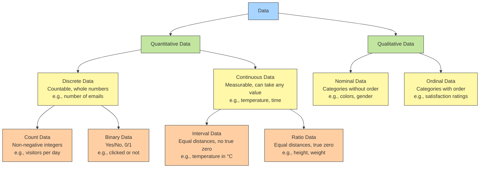

## Getting started with statistical & visual thinking

Or, a modest inquiry into why the mind prefers pictures to sums

---

> **"There is a magic in graphs."**  
> "The profile of a curve **reveals** in a flash a whole situation — the life history of an epidemic, a panic, or an era of prosperity. The curve **informs** the mind, awakens the imagination, **convinces**."

~ *Henry D. Hubbard, National Bureau of Standards*

---

In the last class, we described a visualization as

> a picture that helps someone do something

We visualize data so we can understand information, and make it memorable. <!-- element class="fragment" -->

note: - Data Viz includes _shapes_ that carry strong cultural memories; and impressions for us. These cultural memories help us to use data viz in a _universal way_ to appeal to a wide variety of audiences. (Do humans have a gene for geometry?[1](https://av-quarto.netlify.app/content/courses/nocode/modules/01-natureofdata/#fn1)); 

---

![[IMG-20250318203525617.png]]

---

What does this graph tell you? 

![[IMG-20250318203429639.png]]

<cite>

https://graphics.wsj.com/infectious-diseases-and-vaccines/

</cite>

---

<split even>

But not all is nice and dandy in the dataviz world. It is important to be able to differentiate the good and the bad. 

![[Pasted image 20250319191828.png|500]]

</split>

> ... the Emperor walked through the streets of his capital; and all the people standing by cried out, “Oh! How beautiful are our Emperor's new clothes! What a lovely coat and how gracefully the scarf hangs!”, no one would admit they could not see these much-admired clothes; because, in doing so, they would have declared themselves either a simpleton or unfit for his office...

---

![[IMG-20250319010111978.png|600]]

 
Notice the "reddest" states, what do you think is wrong here? 

<!--element class="fragment"--> 

---

![[IMG-20250319010713691.png|600]]

---

![[IMG-20250319010521797.png]]

<cite>

Page 228, Accidental Deaths and Suicides in India 2022 https://data.opencity.in/dataset/accidental-deaths-and-suicides-in-india-2022

</cite>

---

![[IMG-20250322132433871.png|400]]

 
"Gen Alpha isn't spending anything on alchocol, they're killing the industry!!" <!--element class="fragment"-->

---

### Data, data, data! I cannot make bricks without clay

---

<split even gap="2">

### The Case of the Five Orange Pips

Three Openshaw family members received envelopes with orange seeds
- Each envelope postmarked from different cities worldwide
- Each recipient died mysteriously after receiving the envelope
- Pattern: Time between letter and death shortened (7 weeks → 3 days → 1 day)

![[IMG-20250318235645104.png|400]]

</split>

---

> "I searched the Dundee records, and when I found that the Lone Star was there in January, '85, my suspicion became a certainty. I then inquired as to the vessels which lay at present in the port of London. [...] The Lone Star had arrived here last week. I went down to the Albert Dock and found that she had been taken down the river by the early tide this morning, homeward bound to Savannah."  
> ~ Holmes

---

![[IMG-20250322142027276.png]]

---

Data is produced through **systematic observation, measurement, and recording of specific phenomena**

But far more importantly, it is understood through human interpretation.

note: In Holmes' case, the meaning emerged not from raw data, but his skills of identifying related pieces of information and an interpretation of patterns

---

![[IMG-20250318010106097.png|300]]

 

That means YOU can too!!!

So let us now cook! <!-- element class="fragment"-->

---

How we'll be cooking. <i class="fa-solid fa-down-long"></i>
<iframe width="800px" height="600px" src="https://teaching.aman.bh/iframes/recipe"/>

---

## Spreadsheeeeeee-its

The most _common_ form of data that we'll be looking at in this class is **tabular** data. This comes in tables. This is a table: 

|Date|Boeing Stock Price|Amazon Stock Price|Google Stock Price|
|:--|:--|:--|:--|
|2009-01-01|$173.55|$174.90|$174.34|
|2009-01-02|$172.61|$171.42|$170.04|

![[IMG-20250321211316737.png]] <!--element class="fragment"-->

---

## Types of ~Sabzis~ Data

---

## Discrete and Continuous

If you have quantitative data, then the data can be either continuous or discrete. 

**Discrete data have finite values**, or buckets. You can count them. 

Continuous data _could_ have an infinite number of values, which forms 'a continuum'.

If you find yourself saying "number of...", thats a discrete value. Here are some examples of discrete and continuous data.

| Discrete                                                                                                                     | Continuous                                                                                                     |
| ---------------------------------------------------------------------------------------------------------------------------- | -------------------------------------------------------------------------------------------------------------- |
| 1. Number of children in a household 2. Number of languages a person speaks 3. Number of people sleeping in this class | 1. Heights and weights   2. Decreasing charge on your laptop when you forgot the charger 3. Temperatures |

---

 
 <h3>Nominal</h3> 
Just categories or names
 <ul> <li>Like car brands or blood types</li> <li>You can count them but not rank them</li> </ul> 
 
 <h3>Ordinal</h3> 
Categories with an order
 <ul> <li>Like rankings (1st, 2nd, 3rd place) or satisfaction levels (unhappy, neutral, happy)</li> <li>The order matters, but the gaps between them might not be equal</li> </ul> 
 
 <h3>Interval</h3> 
Equal steps, but zero is made up
 <ul> <li>Like temperature in °F (0°F isn't "no temperature")</li> <li>Equal distances between numbers</li> </ul> 
 
 <h3>Ratio</h3> 
Equal steps with true zero
 <ul> <li>Like weight or time (0 seconds means no time)</li> <li>You can say "twice as much" meaningfully</li> </ul> 
 

---

Identify each type of variable in this table

| Customer_ID | Visit_Date | Store_Location | Visit_Count | Order_Count | Membership_Status | Purchase_Amount | Time_Spent | Temperature_C | Beverage_Type | Food_Ordered | Satisfaction_Rating | Age | Height_cm | Weight_kg | Gender | Favorite_Color |
| ----------- | ---------- | -------------- | ----------- | ----------- | ----------------- | --------------- | ---------- | ------------- | ------------- | ------------ | ------------------- | --- | --------- | --------- | ------ | -------------- |
| 1           | 2025-03-01 | Downtown       | 5           | 12          | Yes               | 8.75            | 24         | 22.5          | Latte         | Yes          | 4                   | 29  | 175.3     | 68.2      | Male   | Blue           |
| 2           | 2025-03-01 | Suburb         | 3           | 5           | No                | 12.50           | 45         | 22.7          | Cappuccino    | Yes          | 5                   | 35  | 162.8     | 55.1      | Female | Red            |
| 3           | 2025-03-02 | Downtown       | 1           | 1           | No                | 4.25            | 15         | 23.1          | Americano     | No           | 3                   | 42  | 180.5     | 78.4      | Male   | Green          |
| 4           | 2025-03-02 | Mall           | 8           | 20          | Yes               | 15.75           | 35         | 21.8          | Frappuccino   | Yes          | 2                   | 19  | 160.0     | 52.3      | Female | Purple         |
| 5           | 2025-03-03 | Downtown       | 2           | 4           | No                | 6.50            | 30         | 22.3          | Espresso      | No           | 4                   | 51  | 168.7     | 70.2      | Male   | Black          |
| 6           | 2025-03-03 | Suburb         | 15          | 42          | Yes               | 9.25            | 55         | 22.9          | Mocha         | Yes          | 5                   | 27  | 155.2     | 48.9      | Female | Pink           |
| 7           | 2025-03-04 | Mall           | 4           | 8           | No                | 11.00           | 20         | 23.2          | Tea           | No           | 3                   | 65  | 172.4     | 65.8      | Male   | Brown          |
| 8           | 2025-03-04 | Downtown       | 7           | 15          | Yes               | 14.25           | 40         | 22.5          | Latte         | Yes          | 4                   | 31  | 165.9     | 58.3      | Female | Yellow         |
| 9           | 2025-03-05 | Suburb         | 2           | 3           | No                | 5.75            | 25         | 21.5          | Americano     | No           | 2                   | 47  | 178.2     | 75.6      | Male   | White          |
| 10          | 2025-03-05 | Mall           | 10          | 25          | Yes               | 18.50           | 60         | 22.0          | Cappuccino    | Yes          | 5                   | 22  | 159.3     | 51.7      | Female | Orange         |

---

## To spot data types, you need to ask questions! 

| Type         | Question Words                  | Description                                                                                        | Operations           | Examples                                                                  |
| ------------ | ------------------------------- | -------------------------------------------------------------------------------------------------- | -------------------- | ------------------------------------------------------------------------- |
| **Ratio**    | How many/much? When? How often? | Quantities with scale & meaningful zero. **Differences and ratios/products are meaningful**     | Correlation          | Length, Weight, Time, Temperature (K), Currency, Counts, Concentration |
| **Interval** | How many/much? When?            | Quantities with scale but no meaningful zero. **Differences meaningful, but not ratios**        | Mean, SD             | Temperature (°C, °F), Dates, pH, Test scores (SAT, IQ)                 |
| **Ordinal**  | How? What kind/sort?            | Categories with specific order/ranking. **Items in defined order** (e.g., small, medium, large) | Median Percentile | Education levels, Ratings, Socioeconomic status, Likert scales         |
| **Nominal**  | What? Who? Where? Which?        | Categories with no inherent order. **Names, places, things**                                    | Count, Mode       | Names, Gender, Colors, Blood types, Countries, Categories              |

_Selecting the right data type is crucial for proper analysis and visualization_

---

> All happy families are alike; each unhappy family is unhappy in its own way.
>  
> ~ Leo Tolstoy, _Anna Karenina_

---

But first, some Brad Pitt

<iframe width="560" height="315" src="https://www.youtube.com/embed/PlKDQqKh03Y?si=7wYTlkwglH9PVLFx" title="YouTube video player" frameborder="0" allow="accelerometer; autoplay; clipboard-write; encrypted-media; gyroscope; picture-in-picture; web-share" referrerpolicy="strict-origin-when-cross-origin" allowfullscreen></iframe>

---

 
 

### Mean
The **arithmetic average** 

- Sum of all values divided by the number of values 
- Most commonly used measure 
- Significantly influenced by outliers 
- Example: In {3,5,6,7,7,9,8,7,5,6,4,5,3,1}, the mean is 5.43 

 
 

### Median
The **middle value** 
- Data must be arranged in order 
- Particularly useful for skewed distributions 
- Stable with unusually large/small values 
- Example: In {1,3,3,4,5,5,5,6,6,7,7,7,8,9}, the median is 5.5 

 
 
### Mode
The **most frequent value** 
- Shows what value occurs most often 
- Can have multiple modes (bimodal, multimodal) 
- Doesn't necessarily represent the center 
- Example: In {3,5,6,7,7,9,8,7,5,6,4,5,3,1}, the mode is 7 

 
 
---

<iframe src="https://teaching.aman.bh/iframes/central-tendency" height="600px" width="900px"/>

---

![[IMG-20250321181827943.png]]

---

## Tools to keep ready

![[IMG-20250318220630892.png]] 

 

In case you haven't downloaded it already, links to download in the slide below.  

---

Why bother visualizing?

---

Getting information from a table is like extracting
sunlight from a cucumber. ‐‐‐ Farquhar & Farquhar,
1891

---

<iframe src="https://teaching.aman.bh/iframes/datasaurus" height="585px" style="overflow-y:hidden;" width="900px"/>

---

PRE-ATTENTIVE VARIABLES
Designers can make intentional use
of pre-attentive variables in stage one
to increase the performance of target
detection, boundary detection, region
tracking, counting and estimation.
– Isabel Meirelles

---

"The more ubiquitous data becomes, the more we need to experiment with how to make it unique, contextual, intimate."

![[IMG-20250319002843226.png|800]]

<cite>

https://giorgialupi.com/data-humanism-my-manifesto-for-a-new-data-wold

</cite>

---
<iframe width="560" height="315" src="https://www.youtube.com/embed/NX43rzXQaik?si=GVGKEdFr-8K0bJnW" title="YouTube video player" frameborder="0" allow="accelerometer; autoplay; clipboard-write; encrypted-media; gyroscope; picture-in-picture; web-share" referrerpolicy="strict-origin-when-cross-origin" allowfullscreen></iframe>
