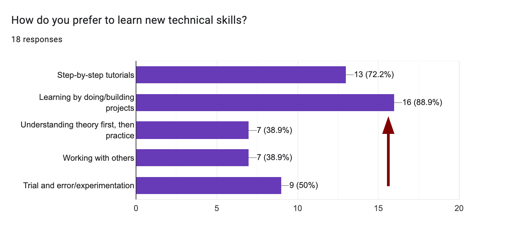

# Introduction To Making For the Web
#### _WEB2025 - Day 1_

---

<split even gap=2>

## Today's Plan 

|   Thing   |   Time for Thing   |
| --- | --- |
|   Class overview  |  20 min   |
|   Introduce yourself!  |  25 min   |
| **Lecture** | ~50 min |
| Break | 10 min |
| Internet Archaeology: Part 1 | 45 min |
| Lunch |  |
| Internet Archaeology: Part 2 | 45 min |
| Discussions | 45 min |
| Assignment Setup | 20 min |

</split>

---

# What Is This Class? 

Before we can properly answer that question, I would like to situate my context for you, and to do that, we need to address the biggest shift in our field in a generation.

---

## Who here thinks AI is a good thing for creatives?

---

## Who here thinks AI is a bad thing for creatives?

---

## I ask this because things...have changed

I promise you I am not an AI salesman/LinkedIn Lunatic; but they certainly have.

notes: The reason I start with this is that the rapid emergence of AI has thrown a wrench into our old assumptions about what it means to be a designer, a developer, or a creator of any kind. It's forcing us, whether we like it or not, to re-evaluate our roles, our skills, and our value.

---

When you think of making websites, you might have been taught a process that looks something like this.

  David Hodder
  <a href="https://www.davidhodder.com/websitedesigndevelopmentstages/" target="_blank">Website design and development stages</a>.
  

  

---

This is the traditional waterfall model: a linear, sequential process where each stage is completed before the next one begins.

---

## This model is not invalid. It’s still how many websites are built.

### And for many projects, this works great. <!--element class='fragment'-->

---

The problem with it is that as designers, we're often told to care about "our side" of the process. This model almost encourages us to be siloed. 

- Conduct user research.
- Create low-fidelity wireframes.
- Develop high-fidelity wireframes.
- Establish visual identities.
- Oversee developer implementation.
- "Stay in your lane."

 It positions the designer as someone who creates a static blueprint, which is then handed over to a developer to be "executed."<!--element class='fragment'-->
 
notes: This "stay in your lane" mentality creates a gap. A gap in understanding, a gap in communication, and most importantly, a gap in creative potential. 

---

### But what if you want more?

- Understand what's possible with the technology _before_ you start designing?
- Communicate more effectively with developers because you speak a bit of their language?
- Making your own weird experimental thing because _you_ want to?

---

### Staying in your lane is alright

But sometimes you might want to cross the street.

---

<split even>

### This isn't about asking you to become everything

No one needs to do everything! But being a little T-shaped is a huge advantage. 

</split>

notes: You have your expertise in your core discipline, that's the vertical bar of the T. But you also cultivate a broad-enough understanding of adjacent fields, the horizontal bar, to collaborate effectively, to prototype your own ideas, and to have a direct, hands-on conversation with the materials you're working with.

---

<split even gap="1">

Because when computers can talk and write code for us, make entire products from scratch, where does that leave us? What are the lanes?

- Do we need designers who just design?<!--element class='fragment'-->
- Do we need coders who just code?<!--element class='fragment'-->
- Do we need mockups and wireframes, or is all just vibes?<!--element class='fragment'-->
- Does everyone become a manager?<!--element class='fragment'-->

Are there any lanes? <!--element class='fragment'-->

</split>

---

## I don't know, it is too early to tell

But to me, one thing is clear; there is no disadvantage in: 

- Learning a little more and developing familiarity with all parts of the process.<!--element class='fragment'-->
- Being able to prototype and iterate quickly without depending on others.<!--element class='fragment'-->
- Having direct conversations with the medium you're designing for.<!--element class='fragment'-->

I think LLM's make this easier than ever before. .<!--element class='fragment'-->

---

## Is AI good? Is AI bad?
Like with a lot of things, the most sensible answer is...it depends.

Me, I think of it and it's usefulness in the context of code.

---
<split even>

## My View

I resonate with this [blogpost](https://www.robinsloan.com/lab/is-it-okay/) by Robin Sloan on whether AI is "okay".

</split>

---

This brings us to the perennial, and frankly, boring question.
## So should designers code? 

Maybe that is the wrong question...<!--element class='fragment'-->

notes: It frames coding as a simple vocational skill to be acquired, like learning to use a new piece of software. The real question is about the nature of the medium itself and our relationship to it.

---

  Weaver, J. (2020). 
  <a href="https://hairyelefante.medium.com/we-dont-need-more-designers-who-can-code-b81483d2a0e6" target="_blank">We Don’t Need More Designers Who Can Code</a>.
  

  

---

<split even gap="2">

> A design is never “ready for dev”, because a lot of what we consider to be design decisions – interaction, animation, loading of data – can really only be prototyped in code. “Ready for dev” implies that the creation is done and that the developer is merely there to execute the designer’s vision

</split>

  Madsen, R. (2025). 
  <a href="https://designsystems.international/ideas/when-figma-starts-designing-us/" target="_blank">When Figma Starts Designing Us / Design Systems International</a>.
  

  

notes: The point is that code isn't just an implementation detail; it's the _material_ of the web. It's the clay. You can't truly understand what's possible with clay, its texture, its weight, its limitations, and its surprising possibilities, until you get your hands dirty. You need to have that direct conversation with the medium.

---
## That is the point of this class

We want to focus on learning a bit on **how to make The Thing for our purposes**, not become expert developers who are writing code for production-ready software. 
 
Code is the means to an end. 

notes: We're learning to code not to become professional developers, but to become better designers, thinkers, and makers. We're learning just enough to be creatively independent, to build our own prototypes, and to express our own ideas directly in the native language of the web.

---
#### Because AI doesn't mean you "don't need to learn anything". 
<split even gap="2">

Understanding what code is, how to get what you want, and how to be in control is just as necessary.

 
 For that we need to get our fundamentals in order.

</split>

---

## How do we do this? 

---

### The Just-Enough Rule

The amount **you _could_ learn** is endless and overwhelming. 

The amount **you _can_ learn** just enough to get started is manageable and more meaningful.

It seems we all agree!

---

## To grow, designers must be

- hands-on
- experimental
- ambitious

---
## This class is

- hands-on
- experimental
- ambitious

---

<split even gap="2">

We have three weeks together.

</split>

---

<split even gap="2">

In the first, we'll learn  how to get comfortable with our tools   and make basic HTML sites.

</split>

---

<split even gap="2">

In the second, we'll learn how to use Astro, a modern SSG framework   and supercharge our HTML.

</split>

---

<split even gap="2">

In the last, we'll work on  refining our content, identities and sites   and make our websites live.

</split>

---

> I will consider this successful if I can witness a growth in my thinking process and at the end of the course, **have the urge to learn more rather than end up despising it is something that will make it successful for me**

~ Student in Pre-Class Survey (Thank you)

---

# What Is This Class? 

---

<!-- slide data-auto-animate -->

        <h2 class="main-word fragment highlight-current-blue" data-fragment-index="0">Immersive</h2>
        <h2 class="main-word fragment highlight-current-blue" data-fragment-index="1">Web</h2>
        <h2 class="main-word fragment highlight-current-blue" data-fragment-index="2">Design</h2>
    

        

            

                
Thoughtful

                
Complete

                
Enriching

            

            

                
Small

                
Personal

                
Living

            

            

                
Intentional

                
Crafted

                
Human

            

        

    

notes: We don't mean VR headsets, we mean getting involved in the process from concept to creation. Not the massive, corporate web, but the _small, personal, living_ web.Not just pushing pixels in Figma. 

---

## Welcome aboard!

---

<split even gap="2">

### A quick round of introductions? 

</split>

---

# Indiana Jones and the Raiders of the Lost Web

---

## A little about me

I am a developer who designs. I specialize in data visualization and public-interest technology.

 

I have an interest in maps, history, urbanism, and open-source software.

---
<split even gap="2">

#### I've worked for these people

</split>

---

<!-- slide bg="[[IMG-20250712210848865.png]]" -->

---

---
<section data-background-size="cover" data-background-video="[votes-2](output.mp4)">
</section>

---
<section data-background-size="contain" data-background-video="[votes-2](votes-2.mp4)">
</section>

---
<!-- slide bg="[[IMG-20250715001259582.png]]" -->

---
<!-- slide bg="[[IMG-20250715001407412.png]]" -->

---

---

## It all started 10 years ago

---

A website where I wrote "issues" of the newspaper from Harry Potter.

---

I also made websites for Hogwarts. Very legit, as you can see.

---

I had a form on the site where if you filled it, you got your own Hogwarts ticket...

---

...and to this day I get emails from little kids thinking it is real. I made a website for that too.

---

---

<video autoplay loop muted preload="none"
       src="[[eth.mp4]]"
       style="max-width: 960px; display: flex; justify-content:center;">
</video>

---

---

You get the idea. Websites.

---
# [it is just]...a few acres of snow

_Voltaire commenting on Canada_

---

   
  <a href="https://neal.fun/internet-artifacts/" target="_blank">Internet Artifacts</a>.
  

  

---

  Tait, A. (2016). 
  <a href="https://www.newstatesman.com/science-tech/2016/08/25-years-here-are-worst-ever-predictions-about-internet" target="_blank">25 years on, here are the worst ever predictions about the internet</a>.
  

  

---
# The first websites
---

Personal websites soon comprised most of the public sites on the early Internet and essentially became the public face of the Internet.

Other than a few blank placeholder websites, corporations and governments had not even established their presences on the Internet. 

**Most were not even convinced that they should be there.**

   (2022). 
  <a href="https://cheapskatesguide.org/articles/old-internet-coming-back.html" target="_blank">The Old Internet Shows Signs of Quietly Coming Back</a>.
  

  

notes: Back in the early 1990's, the spirit of the Internet was the pursuit of knowledge, exploration, innovation, fun, and community. Immediately after going public, it began to swell with websites created by tech nerds who enjoyed playing and experimenting with the new technology. Individuals created their own websites mostly for fun and for the learning experiences that they afforded. Most discussed little more than computer gaming, technical interests, and geeky hobbies. 

---

---

---

## Enter the era of Geocities

---

<split even gap="1">

Geocities was divided into "neighborhoods", like area and street names, where users could "claim" their web site. 

The neighborhoods where intended to cover different topics, but you could also just host your own website there.

> "We all have something to share with each other, which enriches both their lives and ours as well."

 ~ David Bohnett, Creator of Geocities

</split>
---
<!-- slide bg="https://i.imgur.com/m2oi0bw.jpeg" -->

---

> "The web was no longer something understood by the public as being a passive area of consumption; it was presented as something that you could live in. Most importantly, it was
easy to move in."

  Milligan, I. (2017). 
  <a href="http://www.jstor.org/stable/10.2307/j.ctt1mtz55k.13" target="_blank">Welcome to the web: The online community of GeoCities during the early years of the World Wide Web</a>.
  

   UCL Press.

---

---

 Geocities was important because it provided Digital Natives with a system for creative expression that worked for everyone: coding space for those with HTML skills and simple navigation tools for beginners to build pages

 
It was not the only place where people did this, but it was by far the most popular.

   
  <a href="https://archive.blogs.harvard.edu/digitalnatives/2009/04/26/living-and-dying-on-geocities/" target="_blank">Digital Natives » Blog Archive » Living and Dying on Geocities</a>.
  

  

---

## The Vernacular of the Old, Personal Web

Animated GIFs, page hit counters, scrolling marquee text, "under construction" signs, and wild tiled backgrounds. It's easy to look back now from our minimalist, professionally designed present and call it "bad design."...

---
<section data-background-size="cover" data-background-video="[votes-2](uc.mp4)">
</section>
---

---

 ..but it was the visual language that emerged when ordinary people, not professional designers, were in charge of their own little corner of the web. 
 
 **It was expressive, personal, and delightfully chaotic.**
 
---

---

---

---

 
 
---

---

Geocities was a centralized platform, and not the only way to get online, but the metaphor of a physical, connected (but your own) space perhaps made it one of the most popular. 

---
## Yahoo bought Geocites in 1999 and it was freefall from there

---

## 25 years on, we make the same mistakes

"One day, Twitter and other publishing platforms like Facebook, Instagram, or Medium will indeed die, like so many sites before them. And every time this happens, we lose most of the content we created and with it a fair amount of our collective cultural history."

  Ott, M. (2019). 
  <a href="https://matthiasott.com/articles/into-the-personal-website-verse" target="_blank">Into the Personal-Website-Verse · Matthias Ott</a>.
  

  

---

---

   
  <a href="https://qz.com/333313/milliions-of-facebook-users-have-no-idea-theyre-using-the-internet" target="_blank">Millions of Facebook users have no idea they’re using the internet</a>.
  

  

---

The web has from being a vast, messy, decentralized collection of individual sites to an ecosystem dominated by a few massive, centralized platforms like Facebook, Google, and Twitter.

---

## And that's bad!

The new corporate web is built on convincing you that making a website is hard, complicated, and something you can't do yourself.

---
### A business model built on telling you that you can't

notes: Website builders lure you in with "free" tiers that are intentionally and severely limited. They hold your content, your design, and your audience hostage, preventing you from using your own domain name and constantly upselling you to the next subscription tier. Their goal is to make you a perpetual renter, not an owner.

---
<!-- slide bg="[[pricing.png]]" -->

---

They love to limit you:

- Up to 10 pages
    
- Up to 2GB storage
    
- Upgrade for a custom domain or keep using `baburao.myportfolio.com`
    
- Upgrade to remove their branding
    
- Upgrade to see analytics
    

They love to make you feel dumb, to convince you that this is a magical, complex process that only their proprietary, closed-source tools can handle. But it's not.

---

## And the other culprit is conformity

Or rather, the expectation to conform. The instinct to crush creativity. 

---

---

## Remember, I'm talking about the small web

This isn't about websites for huge companies, digital services or e-commerce or any of that. That might still benefit from the Sameness. 

 

But the small, personal web is a chance to shed all you've been taught.

---

> _Don't use too many colours. Write short, catchy headlines. Don't let content be too long. Optimise for SEO. Produce video content, attention span is decreasing. Have a an obvious call to action. Push your newsletter. Keep important information above the fold. Don't make users think. Follow conventions._

  Satyal, P. 
  <a href="https://neustadt.fr/essays/the-small-web/" target="_blank">Rediscovering the Small Web - Neustadt.fr</a>.
  

  

---

## Do you...

- Paint for optimizing engagement?
- Tend a garden to maximize ROI?
- Cook for friends to improve your conversion rate?
-
---

## The Small Web doesn't have to be user-centric

*gasps* 

What did he just say...

---

Yes! The Small Web can be "author-centric". It can be you-centric. It’s the difference between product and art.

---

> If the commercial web is "industrial", you could say that the small web is "artisanal". One is not better than the other. They serve different needs and both can co-exist in an open web. It would nevertheless be a shame if we only spent time on the commercial web and never got the opportunity to experience the creativity, passion and quirkiness of the small web.

---

---

---

---

---

---

---

## Before looking forward, let us look back

To really grasp what's special about making your own things on the web today, we may benefit from doing a dive into a bit of history.

---

We're going on an expedition, a bit of **Internet Archaeology**, to dig through the digital ruins of the late 90s and early 2000s.

---
### The Internet Archive's Wayback Machine

[The most important tool](https://web.archive.org/) for any internet archaeologist. It has saved snapshots of billions of web pages over time.

---
<split even gap="2">

Enter a URL, select a year from the timeline, then click on a specific date in the calendar to see a snapshot of the site from that day.

</split>

notes: The goal is to move beyond simple aesthetic judgment ("this looks ugly") and toward historical analysis ("_why_ does it look this way?")

---

### The GeoCities Archives

Since GeoCities was shut down by Yahoo in 2009, volunteer groups like the Archive Team have rescued and archived terabytes of its data. 

---

<split even gap="2">

- https://geocities.restorativland.org/ Direct mirrors of old GeoCities sites, neatly sorted by their original "neighborhood". A bit like wandering through the ruins themselves.
- [One Terabyte of Kilobyte Age](https://oneterabyteofkilobyteage.tumblr.com/): An art project by Olia Lialina and Dragan Espenschied that posts random, automated screenshots from the archive. 

</split>

---

### The Web Design Museum

<split even gap="2">

[A gallery of screenshots and videos of websites through the years.](https://www.webdesignmuseum.org/all-websites)

Almost the same as the Internet Archive, but organized in a browsable way.

</split>

---

## Activity Brief

1. Dive into each of these archives. Get lost. Follow links. See what you can find. Maybe look for a website you're interested in if you're using the Internet Archive.
    
2. Find and document at least **7 different types of "artifacts"** that you find interesting. Weird buttons, unconventional menus, graphics, illustrations, these can be anything.
    
3. For each artifact, ask: What does this tell me about the person who made it? What does it say about the technology of the time? Why don't we see this anymore? What need did it serve?
    

---

## What did you find in the ruins?

---

Your main takeaway for today should be
## There is no one right way to design or make. 

---

<split even gap="2">

We'll start some making tomorrow!!

</split>